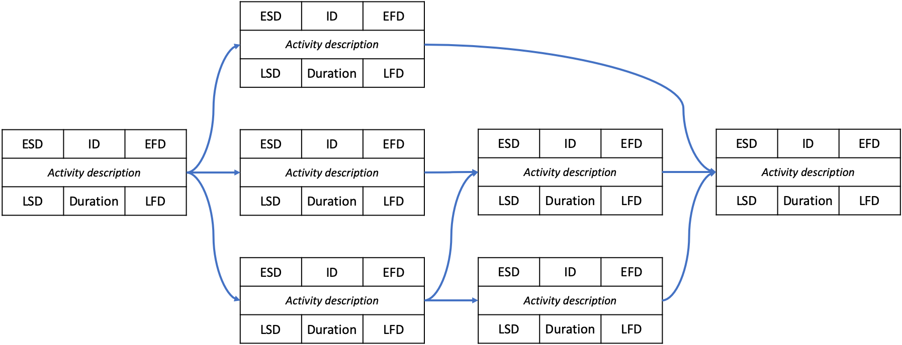
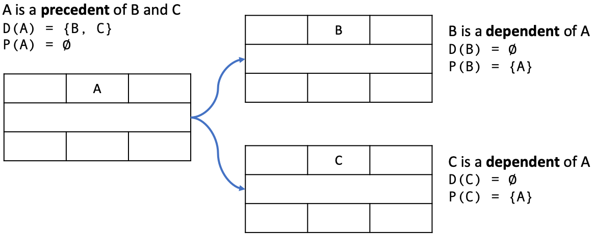
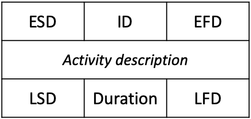
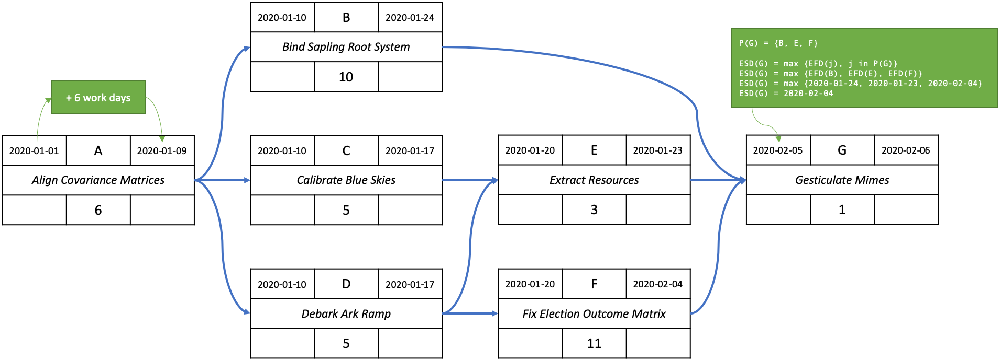
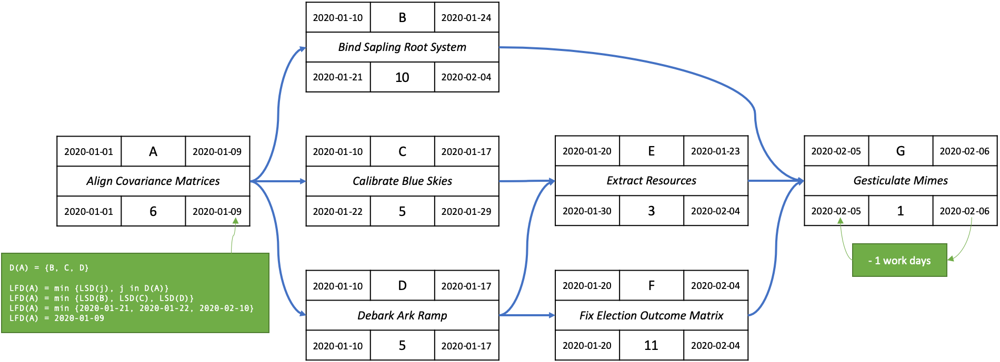
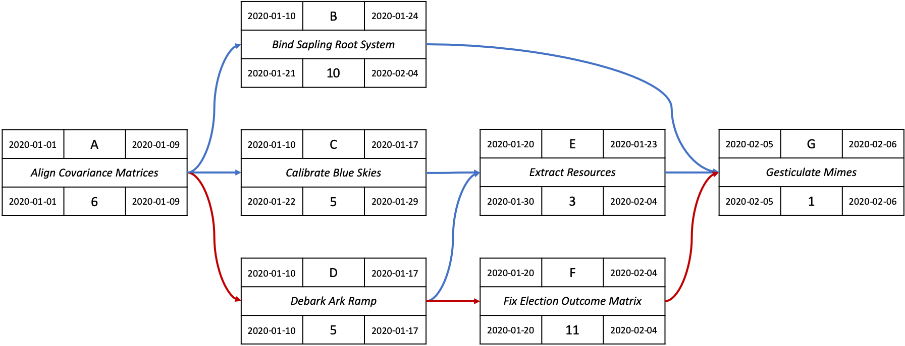
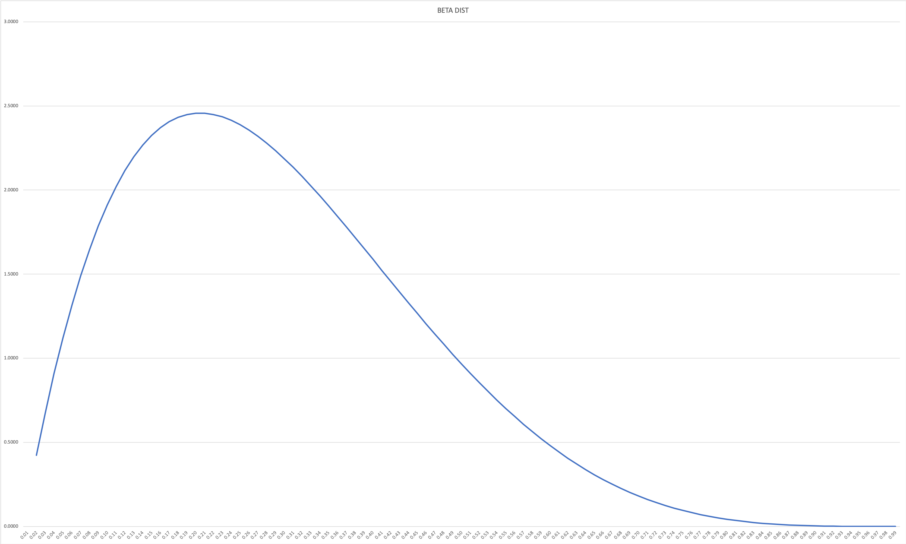
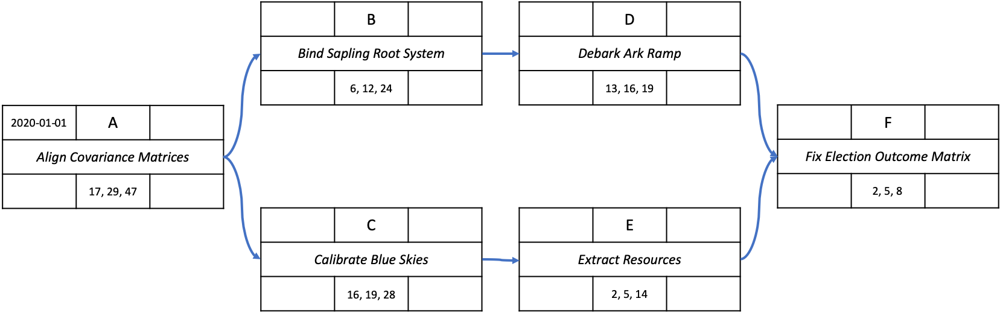
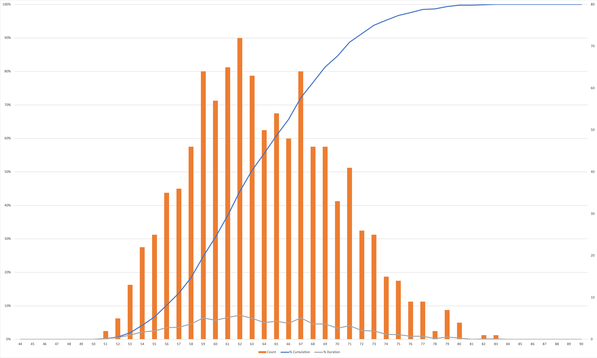

# Probabilistic Project Schedules with Monte Carlo Simulation

> At first I loved a simple plan. Then I realized, with creeping horror, that they were serious. — xkcd

Okay, this quote [is about a song](https://www.explainxkcd.com/wiki/index.php/97:_A_Simple_Plan), but it reminds me of the generalized anxiety we all feel about making plans and then realizing that people actually expect us to follow them. We’re all keenly aware of the uncertain nature of building software, but we’re also equally aware that any business needs plans to function properly. There are real things like externally communicated dates, budgets, and market-critical features to consider, after all.

My goals for this post are to introduce a bridge between uncertainty and planning and to provide a shared planning language that considers both if probabilism is the best we can do. This won’t replace continual improvements teams should make internally – best discussed during sprint retrospectives – but it might help us surface uncertainties and to confidently plan around them even when all other efficiencies have been realized.

I’ll first walk through how to build a project schedule by hand simplified with fixed activity durations. Then, I’ll introduce duration range statements. The final product will be a Monte Carlo simulation from which we can make statements of probability about the project’s completion date.

You can use this planning strategy at the beginning of a project to develop a project schedule that you can give to project leaders. Once you have this baseline schedule established, periodically update your estimates, then re-run the simulation to determine the probability you’ll meet the originally agreed-to date.

I hope you stay with me throughout this post, but feel free to reach out to me if you’d like a walkthrough or have any questions. I’m happy to help.

# Let’s make a project schedule

## Project Networks

A project is made up of activities. When you link activities together in a project to indicate dependencies, each activity becomes a node in a network called a Project Network.

The image below illustrates a project with parallel activities and dependencies. My coder nerds will see a directed graph, a dependency graph (and algorithms to solve the dependency graph and detect circular dependencies), or a constrained network (and interactive constraint relaxing algorithms). My PM nerds will see a Gantt chart, though an oddly shaped one.

Don’t worry about the boxes and text for now; we’ll get to those in just a second. Instead, focus on the path that each line takes through the Project Network. Can you spot the paths and dependencies?



In every Project Network there are precedents and dependents (sometimes called subsequents). **Precedents** are activities that must be completed before dependent activities can start. We represent the set of precedents for a node `A` as `P(A)`. **Dependents** are activities that cannot start until precedent activities have completed. We represent the set of dependents for a node `A` as `D(A)`.



## Activity Node

Projects Networks are made up of Activity Nodes. Each node represents an activity in a project, such as a coding task, an activity with a fixed time duration such as an experiment, or any arbitrary activity like waiting for an email.



The **ID (Activity Identifier)** is a short, unique alphanumeric identifier assigned to each activity. The **Duration** is the number of days it takes to complete an activity. We’ll define ESD, EFD, LSD and LFD later.

## Step 1: The forward pass

The first step to build a project schedule is to complete the ID, Duration, ESD, and EFD values by making a _forward_ pass through the network. So, let’s do that first for a project that starts 2020-01-01.

**ESD (Earliest Start Date)** is the earliest date that the activity can start based on preceding logic and constraints. To calculate this, use the latest EFD in node `A`'s precedent set, `ESD(A) = max {EFD(j), j in P(A)}`. Alternatively, this can be any date greater than or equal to the latest EFD in node `A`’s precedent set. You can also use the second formula if a Project Network is a subset of a larger Project Network. The value of ESD is interpreted as _begin-of-day_.

**EFD (Earliest Finish Date)** is the earliest date that the activity can finish based on preceding logic and constraints. To calculate this for node `A` use `EFD(A) = ESD(A) + Duration(A)`. The value of EFD is interpreted as _end-of-day_.



The forward pass in the example above was `A → B → C → D → E → F → G`. Some of you may notice that this is a breadth-first traversal.

You may also notice that it looks like I’ve added 1 day to the ESD formula. This is because of the begin/end-of-day date interpretation. An end-of-day date is equal to a begin-of-day date. In other words, end-of-day 2020-01-09 is equal to begin-of-day 2020-01-10. Furthermore, end-of-day 2020-01-17 is equal to begin-of-day 2020-01-20 since 2020-01-17 falls on a Friday.
We display dates in this way because the beginning of a date range is typically thought of as begin-of-day and the ending of a date range is typically thought of as end-of-day.

## Step 2: The backwards pass

Next, we’ll do a _backwards_ pass through the network to complete the LSD and LFD values.

**LSD (Latest Start Date)** is the latest date that the activity can start so that it does not delay the project completion date or any constraint. To calculate this for a node `A` we do `LSD(A) = LFD(A) - Duration(A)`. This value is interpreted as _begin-of-day_.

**LFD (Latest Finish Date)** is the latest that the activity can finish so that it does not delay the project completion date or any constraint. To calculate this for node `A`, use the earliest LSD in node `A`'s dependent set, `LFD(A) = min {LSD(j), j in D(A)}`. This value is interpreted as _end-of-day_.



The backwards pass in the example above was `G → F → E → D → C → B → A`. Some of you may notice that this is a depth-first traversal.

So now we know that this project will run from begin-of-day 2020-01-01 to end-of-day 2020-02-06.

## Step 3: Define the Critical Path

Some interesting things that we surface in Step 2 is that there’s some “wiggle room” in some activities like C and E since those activities have ESD ≠ LSD and EFD ≠ LFD. However, there are some activities where there is no wiggle room, meaning that these activities must start and complete on schedule to keep the project on track. The set of activities that can delay a project if not started and completed on schedule is called the **Critical Path**.

The Critical Path set of activities includes activities where `LFD - EFD = 0`. It is especially important to pay attention to these activities since they can delay the project. The Critical Path for our example is `ADFG`.



# What can be improved?

Each activity in our example is given a fixed duration resulting in a fixed duration for the project. However, most projects don’t have this level of exactness.

For example, let’s pretend that we’ve started this project in many, many different universes at the same time. In some universes, the project will complete early, some will complete on time, and some will complete late. The distribution of early, on time, and late completions is “normal” – it looks like a bell curve on a graph. In half of those universes, we complete the project on or before 2020-02-06. In the other half of those universes, the project is late.

Surely, we deserve better than a 50% chance of success, right?

## Building a better duration
The primary driver of project schedules is the duration of activities. Activities rarely complete at the estimated duration; they complete within some range of the estimated duration. So, the first thing we need to do is develop a range statement for each activity’s duration in our project.

A widely used range statement is the **3-point estimate** where `o` is the optimistic duration, `m` is the most likely duration, and `p` is the pessimistic duration. What this means is that we’ll now have durations that are some unknown value that lies between `o`, `m`, and `p`.

There is plenty of literature on the Internet for how to build and discuss a 3-point estimate, so I won’t go into that here. But, I’m happy to help you or your team if you contact me.

## Using a 3-point estimate

If we’re going to produce anything of practical use, we’re eventually going to need to fill in an actual duration value for our activities. Since our durations are now ranges, we need a way to get a value within the range. We’re going to borrow some things from math to do this.

Traditionally in [PERT](https://en.wikipedia.org/wiki/Program_evaluation_and_review_technique), each activity is given a time of `t = (o + 4m + p) ÷ 6`. You might be able to spot that this is an average of the 3-point estimate that favors the most likely estimate in our duration statement. So, the traditional assumption used in PERT is that actual completion times versus the estimate shows a _beta_ distribution, which in this context just means that you have a curve that favors the most likely value.



For now, we’re also going to assume a beta distribution since it models the range for 3-point estimates accurately in most cases. There’s more to be said about choosing an appropriate distribution for your range statement. For example, you can use a different distribution for each estimate depending on your confidence in the estimate. I will explain more in a later post. My advice in the meantime is that if you see pessimistically weighted estimates, ask your team about why this is the case and see if there’s something the team can do to have as much confidence in your most likely estimate as possible.

# Simulating projects

So now it should be apparent that each activity’s duration is variable, so also then ESD, EFD, LSD, and LFD become variable. To construct a schedule, we can randomly pick a value within each duration’s range (using our chosen distribution), and then plug those values into our Project Network. Every time we do this, we get a new project schedule. If we do this many, many times, we get a set of project schedules with which we can work out the _probability_ of the project completing by a certain date.

What’s interesting is that if the EFD and LFD values are variable, then the project’s Critical Path is variable as well. Indeed, it seems logical to imagine that the Critical Path can change as a team completes activities early or late, especially with projects with several similarly-sized parallel activities.  So instead of a single Critical Path for a project, we’ll know the _probability_ of an activity being on the Critical Path.

Running simulations like this and developing probabilistic statements about the outcome is called a Monte Carlo simulation. It’s hard to do necessary thousands of simulations by hand – you’ll need to use Excel or get a developer to help – so I won’t draw out an example here. Instead, I’ll walk through what you’ll get with this approach. I’ll also share my Excel files at the end of this post so you can use them for your own projects.



Running simulations of our example above, we can determine that the project will complete anywhere between 48 and 84 workdays. We’re also able to determine the probability of the number of workdays it’ll take to finish the project, which is illustrated below.



Some probabilities of the number of workdays to finish the project are below, which you can get by following the “% Cumulative” curve of the chart above in Excel.

```
P(n) is probability of workdays

P(64) = 2020-03-31 = 52%
P(68) = 2020-04-06 = 75%
P(74) = 2020-04-14 = 95%
```

We can also make statements about the project’s Critical Path. Critical Path probabilities are

```
P(ABDF) = 73%
P(ACEF) = 18%
P(ABCDEF) = 9%
```

So, while you’ll want to keep an eye on `ABCDEF` and `ACEF`, `ABDF` is more likely to be the Critical Path than not.

When considering staffing, it’s important to consider which activities are likely to have the most impact on the project schedule. Our simulations enable us to state that some activities are on the project’s Critical Path more often than others.

```
P(A) = 100%
P(B) = 80%
P(C) = 29%
P(D) = 80%
P(E) = 29%
P(F) = 100%
```

In this case, you’ll need to make sure that the teams working on activities `A`, `B`, `D` and `F` are staffed appropriately to ensure success.

At this point, you’ve established your baseline project schedule. You should periodically update your estimates based on completed and remaining work. If project leaders find the probability of meeting the original delivery acceptable, then no changes are needed. If on the other hand the probability of meeting the original date is not acceptable, then this method helps you determine which remaining Critical Path stories need the most help to complete.

# Wait, but don’t we use story points?

Yes, but I’ll explain how to still use story points with this approach in a later post. 😎
